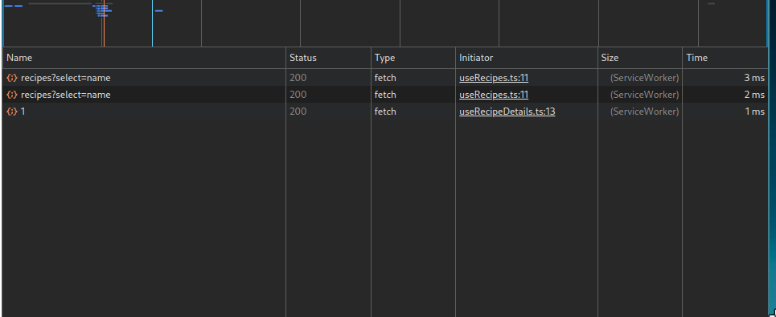

# React, Services Workers and API Caching

This project showcases a application implementing service workers for caching api requests

### How to run

Just run `npm install && npm run dev`. That's all.

### Screenshots

#### Recipies dropdown and details

#### Cached data coming from service worker

